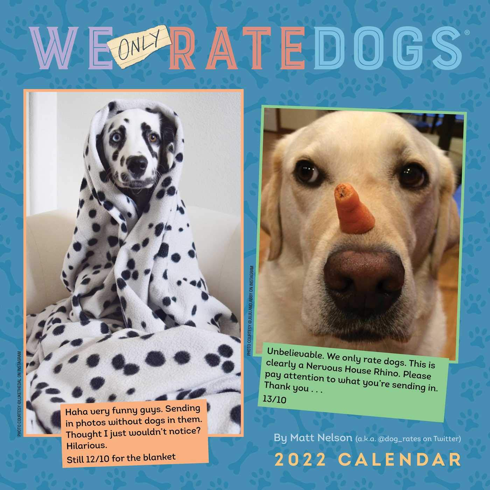

# Wrangle and Analyze Data - WeRateDogs®

**By – Vitalis Dexter**

---

## Introduction

In this project, part of the **ALX-T Data Analyst Nanodegree Program**, we wrangled and analyzed the archived tweets of **WeRateDogs®**. The workflow included:

1. **Assessing** the archive for quality and tidiness issues.
2. **Cleaning** the data to prepare it for analysis.
3. **Analyzing** and **visualizing** key findings.

All steps were implemented using **Pandas** in Python.

---

## Project Details

The WeRateDogs® tweet archive was not clean, as expected. Using Python and its libraries, the data was gathered, assessed, and cleaned to ensure meaningful analysis. The project guidelines restricted cleaning to:

- At least **8 quality issues**.
- At least **2 tidiness issues**.

---

## Steps of the Project

### Step 1: Gathering Data

Three datasets were gathered:

1. **Twitter Archive Enhanced**  
   - A CSV file containing a list of WeRateDogs® tweets and metadata.  
   - Provided by Udacity.

2. **Image Predictions**  
   - A TSV file containing image predictions for images in tweets.  
   - Also provided by Udacity.

3. **Additional Data from Twitter API**  
   - Required access to the Twitter Developer API using the `Tweepy` library.  
   - Data was stored in a `tweet_json.txt` file in JSON format.

---

### Step 2: Assessing Data

All three datasets were assessed both visually and programmatically for quality and tidiness issues.

#### Key Findings:
- In `df_twitter_archive`, the columns `doggo`, `floofer`, `pupper`, and `puppo` could be combined into a single column: `dog_stages`.
- The `image_predictions` dataset lacked documentation, making some columns (`p1`, `p2`, `p3`, etc.) unclear.

---

### Step 3: Cleaning Data

The cleaning phase was divided into three activities:

1. **Creating Copies of DataFrames**  
   - Ensured the original data remained unchanged.

2. **Using a Cleaning Framework**  
   - Followed the **Define-Code-Test** methodology for each documented issue.

3. **Merging Data**  
   - Cleaned DataFrames were combined into a master DataFrame.  
   - Irrelevant columns were dropped to focus on analysis and visualization.

---

### Step 4: Storing Data

The cleaned and combined DataFrame was stored as a CSV file:  
`twitter_archive_master.csv`  
This file served as the basis for the remainder of the project.

---

### Step 5: Analyzing and Visualizing Data

The final phase involved generating insights and visualizations using the cleaned data.  
Key outputs were produced in the Jupyter Notebook: **`wrangle_act.ipynb`**.

#### Deliverables:
- **3 Insights** from the data.
- **1 Visualization** illustrating findings.

---

## Tools and Libraries Used

- **Python**: Core programming language.
- **Libraries**: Pandas, Tweepy, Matplotlib, and others.
- **Data Storage**: CSV and JSON formats.

---

## Conclusion

This project demonstrated the full data wrangling workflow:
- Gathering
- Assessing
- Cleaning
- Storing
- Analyzing and Visualizing

The skills learned will prove invaluable for real-world data analysis projects.

---
